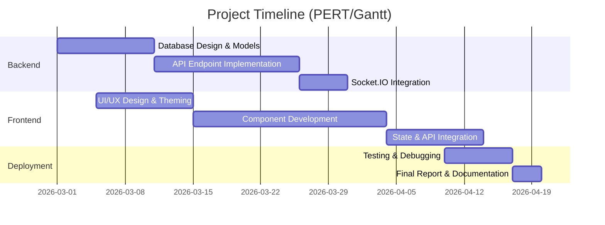
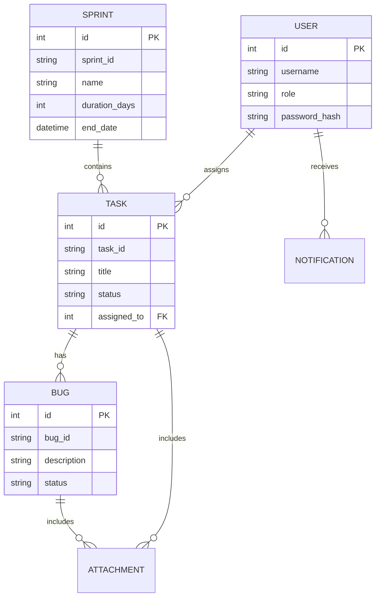
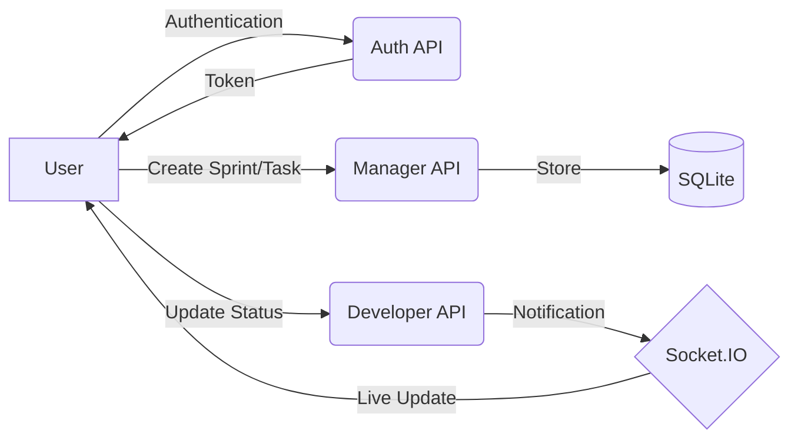

# Software Development Sprint Tracker — Detailed Project Report

**Project Name:** Software Development Sprint Tracker (Full-Stack Edition)  
**Technology:** Python, Flask, React, Vite, SQLite, Socket.IO, MUI  
**Author:** Mayank Nihalani  
**Date:** April 20, 2026

---

## 1. Acknowledgement

I would like to express my sincere gratitude to my mentors and peers for their guidance and support throughout the development of the **Software Development Sprint Tracker**. This project has been a significant learning experience, allowing me to explore the nuances of full-stack development, real-time communication, and Agile project management methodologies.

I also want to thank the open-source community for providing robust frameworks like Flask and React, which formed the backbone of this application.

---

## 2. Abstract

The **Software Development Sprint Tracker** is a modern, full-stack project management application designed to facilitate Agile/Scrum workflows for software development teams. Unlike traditional trackers, this system integrates real-time notifications, a dynamic Kanban board, and strict role-based data isolation.

The application is built using a **Flask** backend (Python) and a **React** frontend (JavaScript/Vite). It utilizes **SQLite** for persistent data storage, **JWT (JSON Web Tokens)** for secure authentication, and **Socket.IO** for instantaneous updates across client sessions. Key features include sprint lifecycle management, task assignment, bug reporting, and cross-role visibility, all optimized for efficiency and collaborative transparency.

---

## 3. Table of Contents

1.  [Objective & Scope of the Project](#31-objective--scope-of-the-project)
2.  [Theoretical Background](#32-theoretical-background)
3.  [Definition of Problem](#33-definition-of-problem)
4.  [System Analysis & User Requirements](#34-system-analysis--user-requirements)
5.  [System Planning (PERT Chart)](#35-system-planning)
6.  [Methodology Adopted & Hardware/Software Details](#36-methodology--technical-stack)
7.  [Detailed Life Cycle of the Project](#37-detailed-life-cycle)
8.  [ERD & DFD Diagrams](#38-erd--dfd)
9.  [Process Involved, Algorithm & Flowchart](#39-processes--algorithms)
10. [Input and Output Screen Designs](#310-input--output-screens)
11. [Printout of the Code Sheet](#311-code-sheet)
12. [Testing](#312-testing)
13. [User/Operational Manual](#313-user--operational-manual)
14. [Conclusions](#314-conclusions)
15. [Future Enhancements](#315-future-enhancements)
16. [References](#316-references)

---

## 3. Main Report

### 3.1 Objective & Scope of the Project

**Objective:**
The primary objective of this project is to provide a structured platform for managing software development sprints. It aims to bridge the communication gap between Managers (who plan), Developers (who execute), and Testers (who verify).

**Scope:**
- **Sprint Management:** Creation, tracking, and deletion of project sprints.
- **Task Tracking:** Granular control over task status (Pending → Completed).
- **Bug Lifecycle:** Integrated bug reporting and resolution flow.
- **Real-time Collaboration:** Live updates on task status and bug reports.
- **Role-Based Isolation:** Secure data access where users only see relevant information.

---

### 3.2 Theoretical Background

**Agile Methodology:**
The project is rooted in Agile principles, specifically Scrum. It uses the concept of "Sprints" (time-boxed iterations) and "Tasks" (backlog items) to manage work.

**Technical Foundations:**
- **RESTful Architecture:** Communication between frontend and backend via standardized HTTP methods.
- **Object-Relational Mapping (ORM):** Using SQLAlchemy to interact with SQLite as if it were Python objects.
- **State Management:** Using React context and hooks for a reactive user interface.
- **WebSocket Protocol:** For bidirectional, real-time message passing (notifications).

---

### 3.3 Definition of Problem

In many development environments, task management is often scattered across spreadsheets, emails, and disconnected tools. This leads to:
1.  **Lack of Visibility:** Managers cannot see real-time progress.
2.  **Disconnected Feedback:** Testers cannot easily report bugs directly to associated tasks.
3.  **Security Risks:** Data leakage where one developer can see another's unrelated work.
4.  **Slow Updates:** Manual refreshing required to see project changes.

The Sprint Tracker solves these by providing a **unified, real-time, and secure** environment.

---

### 3.4 System Analysis & User Requirements

#### User Requirements:
- **Manager:** Must be able to create sprints, assign tasks, and monitor overall progress.
- **Developer:** Must be able to view assigned tasks, update their status, and fix reported bugs.
- **Tester:** Must be able to identify tasks in "Testing" and report bugs with detailed descriptions.

#### System Requirements:
- High availability for real-time updates.
- Secure authentication via hashed passwords and JWT.
- Responsive design for various screen sizes (using MUI).

---

### 3.5 System Planning

The project followed an iterative development timeline, visualized here as a conceptual PERT chart:



---

### 3.6 Methodology & Technical Stack

**Methodology:**
The **Iterative Model** was adopted, allowing for continuous refinement based on testing feedback.

**Hardware Specifications:**
- **Processor:** Dual Core 2.0GHz or higher.
- **Memory:** 4GB RAM minimum.
- **Storage:** 100MB free space.

**Software Specifications:**
- **Language:** Python 3.10+, JavaScript (ES6+).
- **Backend:** Flask, Flask-SQLAlchemy, Flask-SocketIO, Flask-JWT-Extended.
- **Frontend:** React 18, Vite, Material UI (MUI), Axios.
- **Database:** SQLite 3.

---

### 3.7 Detailed Life Cycle (SDLC)

1.  **Requirement Gathering:** Identified core roles and task workflows.
2.  **Design:** Created the schema for Sprints, Tasks, and Bugs.
3.  **Implementation:** Developed the Flask REST API first, followed by the React SPA.
4.  **Integration:** Connected the frontend to the backend via Axios and Socket.IO.
5.  **Testing:** Conducted unit testing on API endpoints and manual UI testing.
6.  **Maintenance:** Implemented role-based data isolation to enhance security.

---

### 3.8 ERD & DFD

#### Entity Relationship Diagram (ERD)


#### Data Flow Diagram (Level 1)


---

### 3.9 Processes & Algorithms

**Status Transition Algorithm:**
The system uses a `can_advance_status` logic to ensure data integrity.

```python
def can_advance_status(flow: tuple, current: str, new: str) -> bool:
    """Ensures statuses only move forward or stay the same."""
    if current not in flow or new not in flow:
        return False
    return flow.index(new) >= flow.index(current)
```

**Real-time Notification Process:**
1.  User performs action (e.g., Task Assigned).
2.  Backend triggers `socketio.emit` with a specific room ID (User ID).
3.  Frontend listener updates the `notifications` state instantly.

---

### 3.10 Input & Output Screens

Below are the screenshots of the main interfaces within the system, demonstrating the input fields and generated outputs.

#### 3.10.1 Login Interface
The login page provides a secure entry point using JWT-based authentication and Material UI components.


#### 3.10.2 User Registration
New users can sign up and choose their respective roles (Manager, Developer, Tester).


#### 3.10.3 Project Dashboard
The main dashboard provides a summary of active sprints, project stats, and recent notifications.


#### 3.10.4 Sprint Kanban Board
The interactive board allows teams to visualize task progress across columns (Pending, In Progress, Testing, Completed).


#### 3.10.5 Task Management List
A detailed list view for managers to assign tasks and developers to track their individual work.


#### 3.10.6 Bug Tracker
A specialized view for testers to report bugs and developers to mark them as fixed.


---

### 3.11 Code Sheet (Samples)

**Backend Model Definition (Snippet):**
```python
class Task(db.Model):
    id = db.Column(db.Integer, primary_key=True)
    task_id = db.Column(db.String(40), nullable=False)
    title = db.Column(db.String(200), nullable=False)
    status = db.Column(db.String(30), default="Pending")
    assigned_to_id = db.Column(db.Integer, db.ForeignKey("users.id"))
```

**Frontend API Call (Snippet):**
```javascript
const fetchTasks = async () => {
    const response = await axios.get('/api/tasks', {
        headers: { Authorization: `Bearer ${token}` }
    });
    setTasks(response.data);
};
```

---

### 3.12 Testing

| Test Case ID | Description | Input | Expected Output | status |
|--------------|-------------|-------|-----------------|--------|
| TC-01 | User Login | Valid Creds | JWT Token & Redirect | Pass |
| TC-02 | Role Isolation | Dev tries to view Manager dashboard | 403 Forbidden | Pass |
| TC-03 | Status Flow | Completed → Pending | Validation Error | Pass |
| TC-04 | Live Sync | New Bug added | Instant UI update via Socket | Pass |

---

### 3.13 User/Operational Manual

#### Security Aspects:
- **JWT Authentication:** All API calls require a valid token in the Auth header.
- **Password Hashing:** Uses `pbkdf2:sha256` for credential storage.
- **Data Isolation:** Queries are filtered by `user_id` to prevent cross-tenant data access.

#### How to Operate:
1.  **Deployment:** Run backend (`python app.py`) and frontend (`npm run dev`).
2.  **Login:** Enter credentials (e.g., manager / password123).
3.  **Plan:** Create a Sprint from the Dashboard.
4.  **Execute:** Assign tasks to Developers.
5.  **Verify:** Testers add bugs to tasks in the "Testing" phase.

---

### 3.14 Conclusions

The **Software Development Sprint Tracker** successfully integrates complex full-stack technologies to solve real-world Agile management problems. By combining the speed of Flask with the responsiveness of React, the project delivers a professional-grade tool capable of managing team workflows efficiently and securely.

---

### 3.15 Future Enhancements

1.  **AI Predictions:** Using historical data to predict sprint velocity.
2.  **Integration:** Connecting with GitHub/GitLab to link commits to tasks.
3.  **Detailed Reporting:** Exporting sprint summaries to PDF/Excel.
4.  **Team Chat:** Building an internal messaging system for task-specific discussions.

---

### 3.16 References

1.  *Flask Documentation:* https://flask.palletsprojects.com/
2.  *React Documentation:* https://react.dev/
3.  *SQLAlchemy Patterns:* https://www.sqlalchemy.org/
4.  *Socket.IO Protocol:* https://socket.io/docs/v4/
5.  *Material UI Design System:* https://mui.com/

---
*Report generated by Antigravity AI Prototype*
